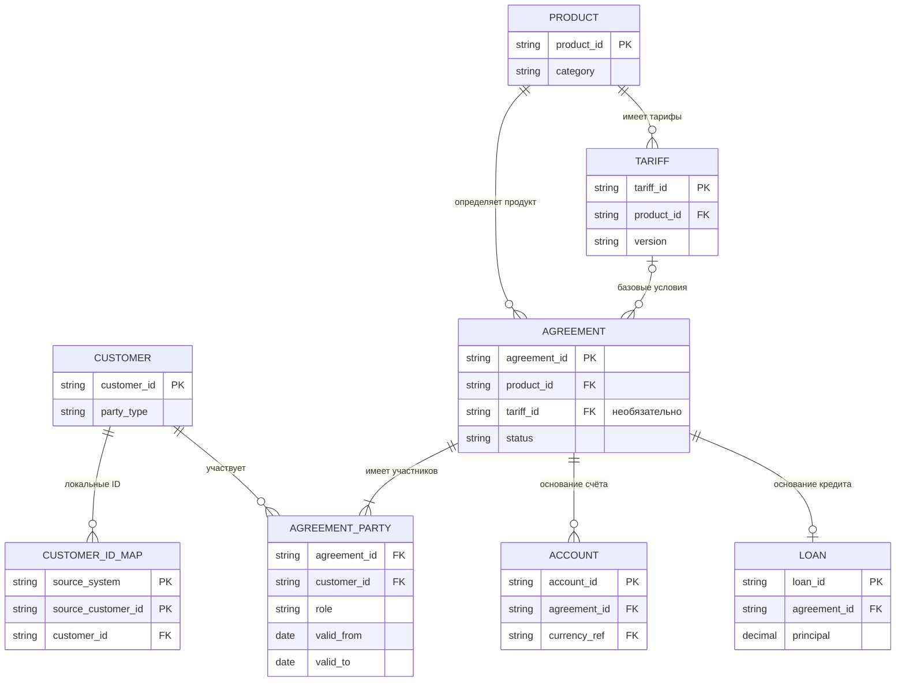

# Клиенты, продукты и договоры

```mermaid
erDiagram
    direction TB

    CUSTOMER ||--o{ CUSTOMER_ID_MAP : "локальные ID"
    CUSTOMER ||--o{ AGREEMENT_PARTY : "участвует"
    AGREEMENT ||--|{ AGREEMENT_PARTY : "имеет участников"
    PRODUCT ||--o{ AGREEMENT : "определяет продукт"
    PRODUCT ||--o{ TARIFF : "имеет тарифы"
    TARIFF o|--o{ AGREEMENT : "базовые условия"
    AGREEMENT ||--o{ ACCOUNT : "основание счёта"
    AGREEMENT ||--o| LOAN : "основание кредита"

    CUSTOMER {
        string customer_id PK
        string party_type
    }

    CUSTOMER_ID_MAP {
        string source_system PK
        string source_customer_id PK
        string customer_id FK
    }

    AGREEMENT_PARTY {
        string agreement_id FK
        string customer_id FK
        string role
        date valid_from
        date valid_to
    }

    AGREEMENT {
        string agreement_id PK
        string product_id FK
        string tariff_id FK "необязательно"
        string status
    }

    PRODUCT {
        string product_id PK
        string category
    }

    TARIFF {
        string tariff_id PK
        string product_id FK
        string version
    }

    ACCOUNT {
        string account_id PK
        string agreement_id FK
        string currency_ref FK
    }

    LOAN {
        string loan_id PK
        string agreement_id FK
        decimal principal
    }
```
