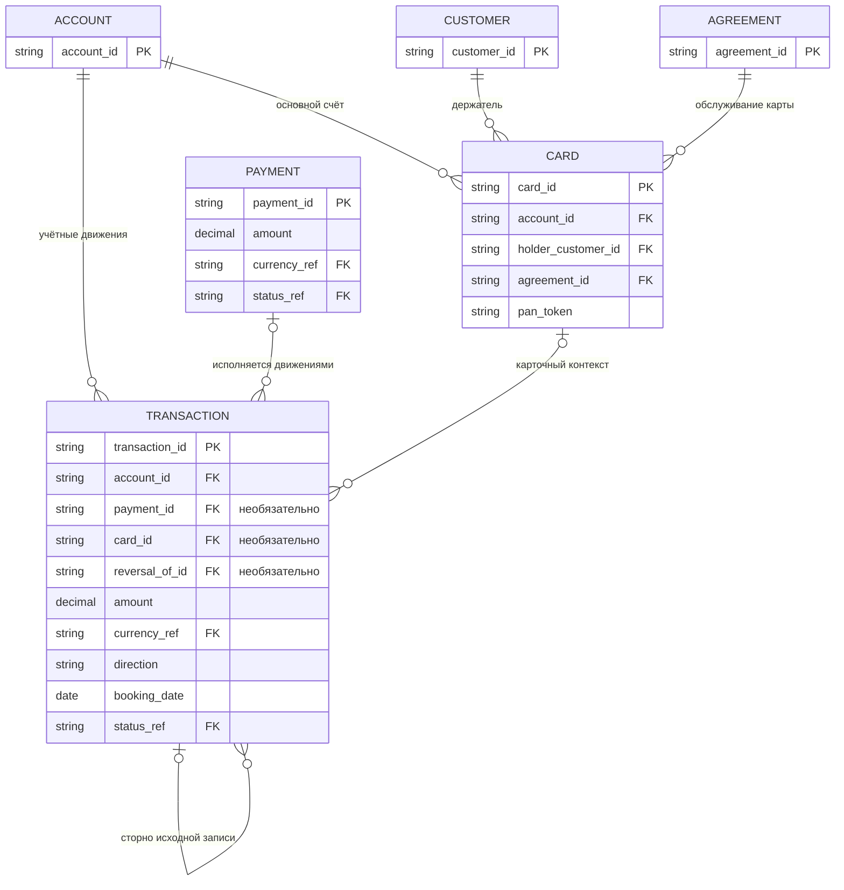

# Платежи, карты и движения

```mermaid
erDiagram
    direction TB

    ACCOUNT ||--o{ TRANSACTION : "учётные движения"
    PAYMENT o|--o{ TRANSACTION : "исполняется движениями"
    CARD o|--o{ TRANSACTION : "карточный контекст"
    ACCOUNT ||--o{ CARD : "основной счёт"
    CUSTOMER ||--o{ CARD : "держатель"
    AGREEMENT ||--o{ CARD : "обслуживание карты"
    TRANSACTION o|--o{ TRANSACTION : "сторно исходной записи"

    ACCOUNT {
        string account_id PK
    }

    PAYMENT {
        string payment_id PK
        decimal amount
        string currency_ref FK
        string status_ref FK
    }

    TRANSACTION {
        string transaction_id PK
        string account_id FK
        string payment_id FK "необязательно"
        string card_id FK "необязательно"
        string reversal_of_id FK "необязательно"
        decimal amount
        string currency_ref FK
        string direction
        date booking_date
        string status_ref FK
    }

    CARD {
        string card_id PK
        string account_id FK
        string holder_customer_id FK
        string agreement_id FK
        string pan_token
    }

    CUSTOMER {
        string customer_id PK
    }

    AGREEMENT {
        string agreement_id PK
    }
```
