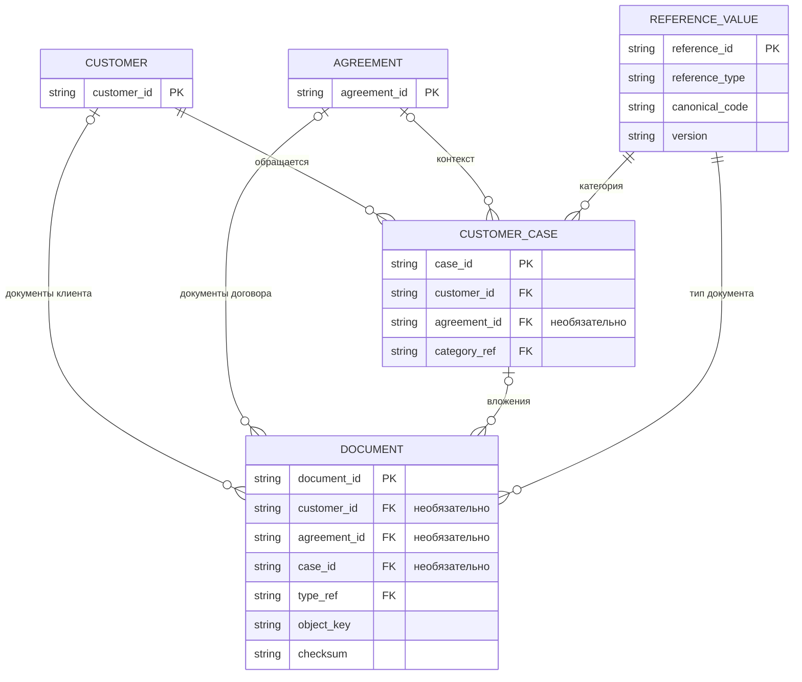

# Обращения и документы

```mermaid
erDiagram
    direction TB

    CUSTOMER ||--o{ CUSTOMER_CASE : "обращается"
    AGREEMENT o|--o{ CUSTOMER_CASE : "контекст"
    CUSTOMER o|--o{ DOCUMENT : "документы клиента"
    AGREEMENT o|--o{ DOCUMENT : "документы договора"
    CUSTOMER_CASE o|--o{ DOCUMENT : "вложения"
    REFERENCE_VALUE ||--o{ CUSTOMER_CASE : "категория"
    REFERENCE_VALUE ||--o{ DOCUMENT : "тип документа"

    CUSTOMER {
        string customer_id PK
    }

    AGREEMENT {
        string agreement_id PK
    }

    CUSTOMER_CASE {
        string case_id PK
        string customer_id FK
        string agreement_id FK "необязательно"
        string category_ref FK
    }

    DOCUMENT {
        string document_id PK
        string customer_id FK "необязательно"
        string agreement_id FK "необязательно"
        string case_id FK "необязательно"
        string type_ref FK
        string object_key
        string checksum
    }

    REFERENCE_VALUE {
        string reference_id PK
        string reference_type
        string canonical_code
        string version
    }
```
